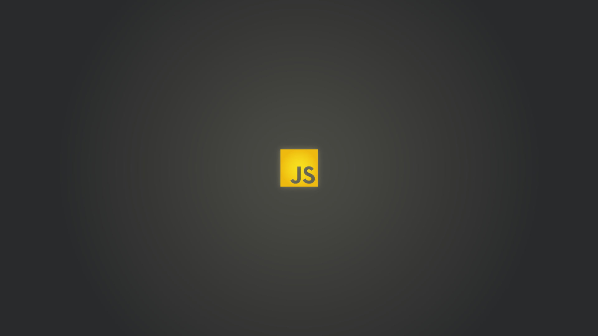

# Heading - 1

## Heading - 2

### Heading - 3

#### Heading - 4

##### Heading - 5

###### Heading - 6

---

**Bold Text**

_Italic Text_

~~Strick Through~~

---

<div>
  <h2>Heading 2</h2>
  <p>This is a Paragraph</p>
</div>

---

> This is a blockquote 1
> This is a blockquote 2
> This is a blockquote 3

---

```js
let a = 10;
let b = 10;
console.log(a + b);
```

---

To run node js code you have to execute terminal command `node main.js`

---

- [x] Task 1
- [x] Task 2
- [ ] Task 3

---

- Unordered List - 1
  - task -1
    - task -a
    - task -b
  - task -2
- Unordered List - 2
- Unordered List - 3

---

1.  Ordered List - 1

    1. task -1
    1. task -2
    1. task -3

1.  Ordered List - 2

1.  Ordered List - 3

---

[GitHub](https://www.github.com/sabbir2809)
[Facebook](https://www.facebook.com/sabbir2809)

---

| No. | Language   | Use Case    |
| --- | ---------- | ----------- |
| 1   | Javascript | Interactive |
| 1   | HTML       | Structure   |
| 1   | CSS        | Style       |

---


